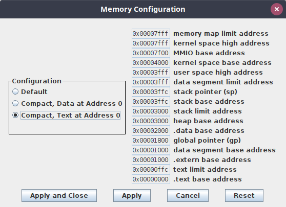
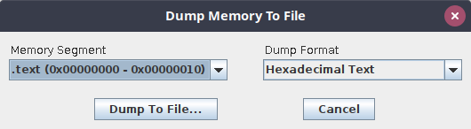
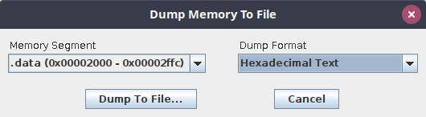

# HARV - HArdened Risc-V

The focus of the HARV processor core is harsh environments. It implements the integer instruction-set of the RISC-V specification (RV32I), except system calls. To provide reliability for harsh environments, we implement the fault tolerance techniques TMR (Triple-Modular Redundancy) and Hamming code to the different parts of the processor. These techniques improve the reliability by mitigating or correcting errors caused by the single-event effects SEU (Single-Event Upset) and SET (Single-Event Transient).

HARV is being developed in partnership between the **LEDS - Laboratory of Embedded and Distributed Systems** and the **LIRMM - Laboratoire d’Informatique, de Robotique et de Microélectronique de Montpellier**.

The HARV was introduced by the paper published at the IEEE DTIS 2020, and it has been in continued:

D. A. Santos, L. M. Luza, C. A. Zeferino, L. Dilillo and D. R. Melo, "A Low-Cost Fault-Tolerant RISC-V Processor for Space Systems," *15th Design & Technology of Integrated Systems in Nanoscale Era (DTIS)*, 2020, pp. 1-5, doi: [10.1109/DTIS48698.2020.9081185](https://doi.org/10.1109/DTIS48698.2020.9081185).

D. A. Santos, L. M. Luza, L. Dilillo, C. A. Zeferino and D. R. Melo, "Reliability analysis of a fault-tolerant RISC-V system-on-chip," *Microelectronics Reliability*, 2021, doi: [10.1016/j.microrel.2021.114346](https://doi.org/10.1016/j.microrel.2021.114346).

D. A. Santos, L. M. Luza, M. Kastriotou, C. Cazzaniga, C. A. Zeferino, D. R. Melo and L. Dilillo, "Characterization of a RISC-V System-on-Chip under Neutron Radiation," *16th International Conference on Design & Technology of Integrated Systems in Nanoscale Era (DTIS)*, 2021, pp. 1-6, doi: [10.1109/DTIS53253.2021.9505054](https://doi.org/10.1109/DTIS53253.2021.9505054).

The current mantainer of this repository is [Douglas Almeida dos Santos](https://github.com/Douglasas).

## Getting started

This getting started is a tutorial for the simulation of the simple assembly program `src/test.asm`

Requirements:
- Vivado 2020.2
- RARS 1.5

Open the RARS and open the assembly file from the sources folder.

You will need to configure the memory to work with the testbench parameters. The following image shows the required memory configuration.



After that, you may export the assembly code so it can be used by the testbench.
Dump both the `.text` and `.data` sections to the `src` folder. The following images shows the configurations that must be used for the memory dump.
The file paths must be `src/test_text.dump` and `src/test_data.dump` for the sections, respectively.




The next step is to create and open the Vivado project.

Execute the following command at the terminal and at the root project directory. Note that Vivado must be in the path.

```
vivado -mode tcl -source script/project.tcl
```

After that, you may open the Vivado project through the interface and run the simulation set 1.
